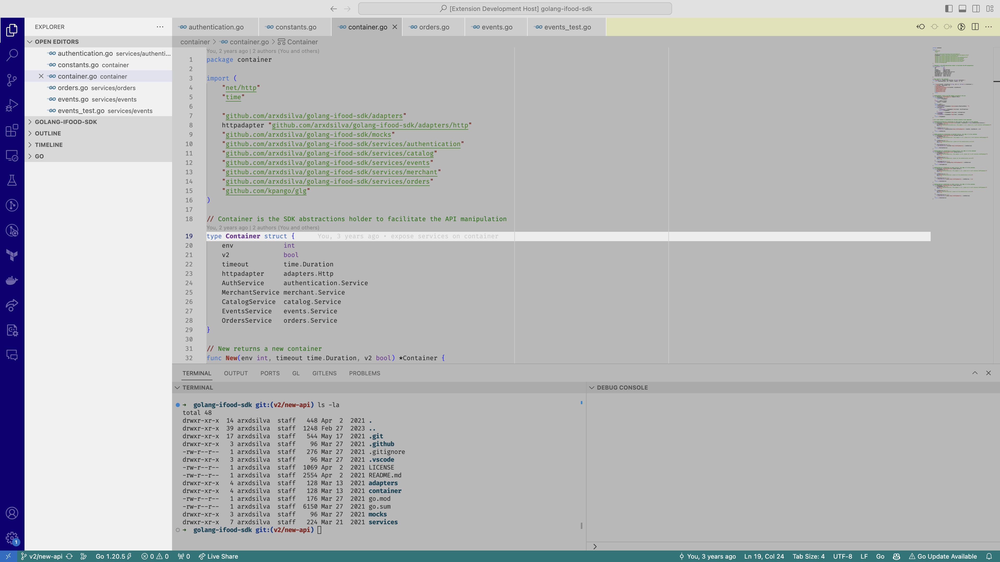

# win95 Theme for Visual Studio Code

## Description

Revive the nostalgic charm of Windows 95 with this theme for Visual Studio Code. The theme offers a familiar interface combined with modern usability and code readability enhancements.

## Features

- **Gray Background**: Enjoy a clean canvas with a light gray background reminiscent of the classic Windows interface.
- **High Contrast Text**: Dark gray text ensures excellent contrast for improved readability.
- **Selection Highlight**: Nostalgic light blue selection color for a touch of the past.
- **Distinct Syntax Highlighting**: Keywords, strings, numbers, and more are highlighted for easy identification.
- **Subtle Element Differentiation**: Brackets, operators, and punctuation marks are styled for recognition without distraction.
- **Error, Warning, and Info Messages**: Quickly spot and address issues with color-coded messages.

## Installation

1. Launch Visual Studio Code.
2. Go to Extensions (Ctrl+Shift+X).
3. Search for "win95".
4. Click Install to apply the theme.

## How to Use

1. Open Visual Studio Code.
2. Press `Ctrl+,` to open the settings.
3. In the settings, locate "Color Theme" and select "win95" from the dropdown menu.

## Feedback and Contributions

If you encounter any issues or have suggestions for improvement, please [submit an issue](https://github.com/arxdsilva/win95/issues) or [create a pull request](https://github.com/arxdsilva/win95/pulls) on the GitHub repository.

## License

This theme is licensed under the [MIT License](LICENSE).