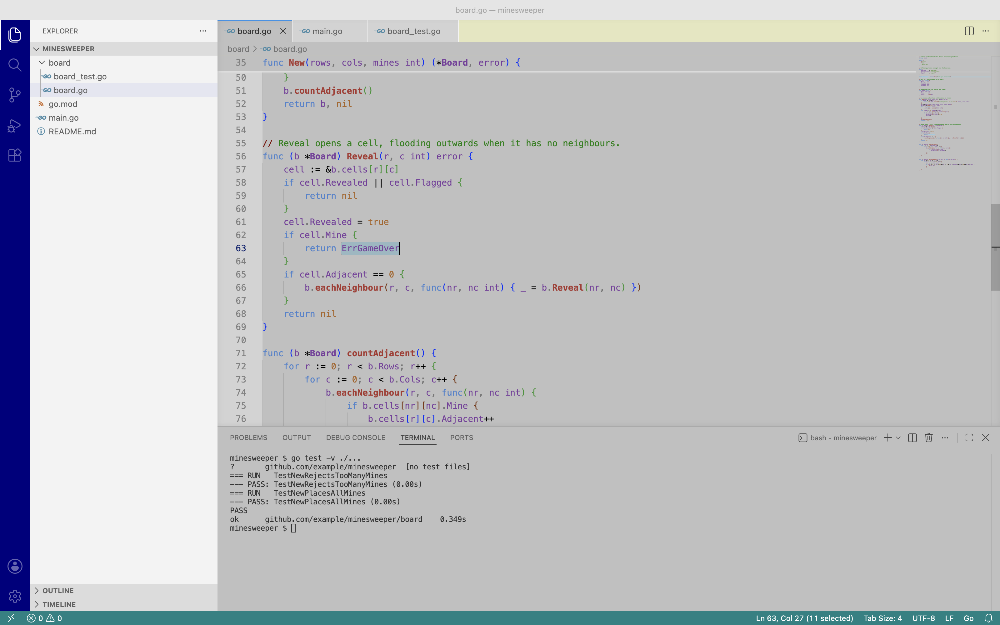

# win95 - Windows 95 Theme for VS Code

**win95** is a free, light color theme for Visual Studio Code, Cursor and VSCodium that recreates the look of Windows 95: a silver-gray `#C0C0C0` editor, a navy `#00007F` activity bar and a teal `#018283` status bar, with syntax colors tuned for readability. Extension ID: `asilva.win95`.



## Quick facts

| | |
|---|---|
| Extension ID | `asilva.win95` |
| Theme type | Light |
| Works in | VS Code, Cursor, VSCodium, Windsurf and other VS Code-based editors |
| Price | Free |
| License | [MIT](LICENSE) |
| Get it from | [VS Code Marketplace](https://marketplace.visualstudio.com/items?itemName=asilva.win95) · [Open VSX](https://open-vsx.org/extension/asilva/win95) |

## Install

- **Extensions view:** press `Ctrl+Shift+X` (`Cmd+Shift+X` on macOS), search for `win95` and click **Install**.
- **Quick Open:** press `Ctrl+P` (`Cmd+P` on macOS) and run `ext install asilva.win95`.
- **Command line:** `code --install-extension asilva.win95`
- **Cursor, VSCodium, Windsurf:** search for `win95` in the Extensions view. These editors install from [Open VSX](https://open-vsx.org/extension/asilva/win95).

## Activate the theme

1. Press `Ctrl+K Ctrl+T` (`Cmd+K Cmd+T` on macOS), or run **Preferences: Color Theme** from the Command Palette.
2. Select **win95**.

Or set it in `settings.json`:

```json
"workbench.colorTheme": "win95"
```

## Color palette

### Interface

| Element | Color |
|---|---|
| Editor background | `#C0C0C0` silver gray |
| Editor text | `#303030` |
| Activity bar | `#00007F` navy |
| Status bar | `#018283` teal |
| Tab bar | `#E5E6BE` khaki |
| Inactive tabs, gutter | `#D3D3D3` |
| Selection | `#ADD8E6` light blue |
| Current line | `#EFEFEF` |
| Line numbers | `#808080` |
| Errors / warnings / info | `#FF0000` / `#FFA500` / `#008000` |

### Syntax

| Token | Color |
|---|---|
| Comments | `#008000` green |
| Keywords | `#4B83CD` blue |
| Strings | `#448C27` green |
| Numbers and constants (`true`, `nil`) | `#AB6526` orange |
| Function names | `#AA3731` red, bold |
| Types and classes | `#7A3E9D` purple, bold |
| Operators | `#000000` black |
| Punctuation | `#777777` gray |

## Features

- **Windows 95 interface colors:** silver-gray editor, navy activity bar, teal status bar and khaki tab bar.
- **Readable syntax highlighting:** distinct colors for keywords, strings, numbers, functions and types on the gray background.
- **Classic light-blue selection** and a light current-line highlight.
- **Color-coded diagnostics:** red errors, orange warnings and green info messages.
- **Works with any language** that VS Code highlights, including Go, TypeScript, JavaScript, Python, Rust, HTML, CSS, JSON and Markdown.

## FAQ

### Is win95 free?

Yes. win95 is free and open source under the MIT License.

### Does win95 work in Cursor, VSCodium or Windsurf?

Yes. The theme is published to the VS Code Marketplace and to Open VSX, so it installs in VS Code and in editors based on it, such as Cursor, VSCodium and Windsurf.

### Is there a dark version of win95?

No. win95 is a light theme only, like the original Windows 95 interface.

### How do I change a single color?

Override it for this theme only in `settings.json`:

```json
"workbench.colorCustomizations": {
  "[win95]": {
    "editor.background": "#BFBFBF"
  }
},
"editor.tokenColorCustomizations": {
  "[win95]": {
    "comments": "#006400"
  }
}
```

### How do I switch back to my previous theme?

Press `Ctrl+K Ctrl+T` (`Cmd+K Cmd+T` on macOS) and pick another theme. To remove win95 completely, uninstall it from the Extensions view.

## Changelog

See [CHANGELOG.md](CHANGELOG.md).

## Feedback and Contributions

If you encounter any issues or have suggestions for improvement, please [submit an issue](https://github.com/arxdsilva/win95/issues) or [create a pull request](https://github.com/arxdsilva/win95/pulls) on the GitHub repository.

## License

This theme is licensed under the [MIT License](LICENSE).
